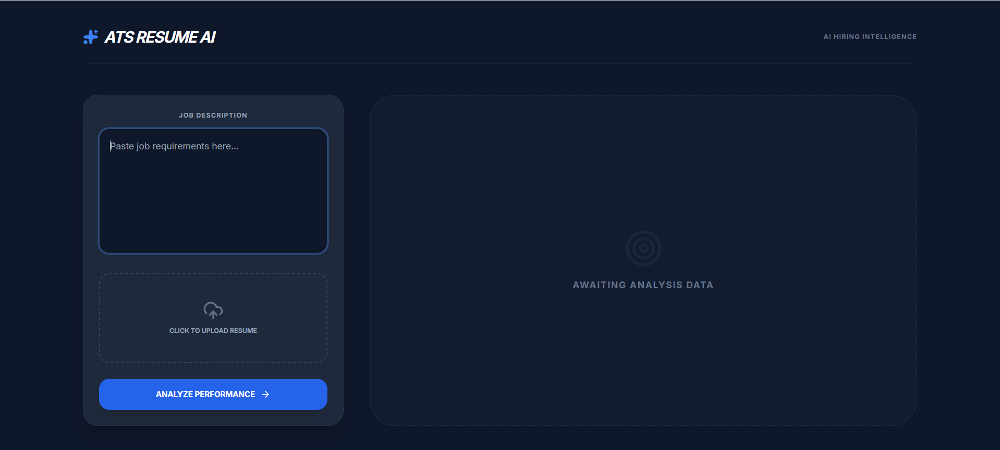
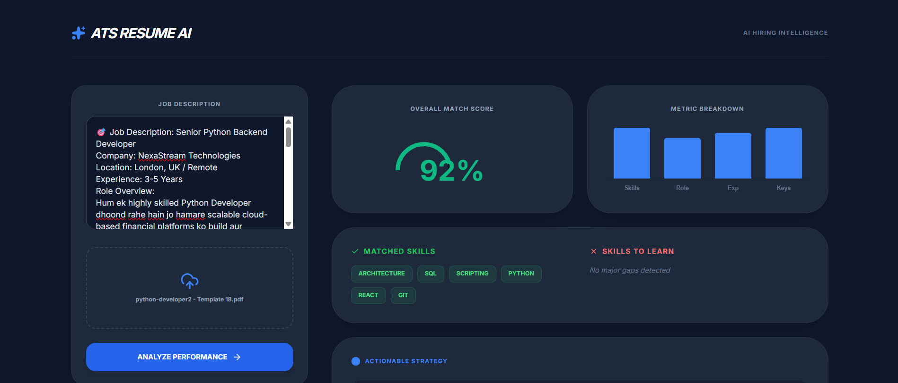
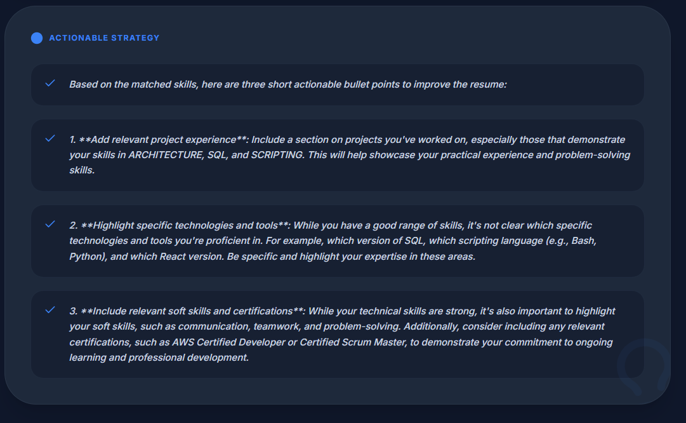

# 🚀 AI Hiring Intelligence Platform (ATS Pro)

The **AI Hiring Intelligence Platform** is a high-performance, recruiter-grade Applicant Tracking System (ATS) designed to bridge the gap between candidate resumes and complex job requirements. 

While most AI tools provide generic matching, this platform uses a **Hybrid Weighted Scoring Engine** that combines deterministic mathematical analysis with semantic LLM intelligence to provide a realistic "Suitability Score."

---

## 📸 Product Interface

### 1. Unified Entry Portal
The landing page features a clean, dark-themed dashboard where users can input job requirements and upload PDF resumes. The system is designed for high-speed parsing and immediate feedback.


### 2. Intelligent Match Analytics
Once processed, the system visualizes compatibility through a dynamic match gauge and a detailed metric breakdown. This helps in understanding exactly where a candidate stands in terms of Skills, Role Match, and Experience.


### 3. Actionable Strategy & Skill Gap
The dashboard identifies exactly which skills are matched and which are missing. It then provides professional, non-generic AI-generated advice to bridge the gap.


---

## 🔥 Key Features

- **Weighted Scoring Algorithm:** Instead of relying on "AI feelings," the system calculates scores based on a fixed ratio: Skills (40%), Role Match (30%), Experience (15%), and Keyword Density (15%).
- **Semantic Role Detection:** Uses the Groq LLaMA 3.1 model to detect if a candidate is applying outside their domain (e.g., a Backend Dev applying for a QA role) and applies an automatic penalty.
- **Smart Skill Mapping:** Recognizes synonyms and related technologies (e.g., "Postgres" matches "SQL" requirements).
- **Automated PDF Parsing:** Leverages PyMuPDF (fitz) for accurate text extraction from complex binary PDF layouts.
- **Data Visualization:** Real-time rendering of Doughnut and Bar charts using Chart.js for better readability.
- **Professional PDF Reports:** Integrated `jsPDF` functionality allows users to download a formal 1-page analysis report.

---

## 🛠️ Technology Stack

### Frontend
- **Library:** React.js (Vite)
- **Styling:** Tailwind CSS (Dark Theme)
- **Animations:** Framer Motion
- **Charts:** Chart.js (react-chartjs-2)
- **Icons:** Lucide React

### Backend
- **Framework:** FastAPI (Python)
- **PDF Engine:** PyMuPDF (fitz)
- **Environment:** Python Dotenv & Pydantic

### AI Engine
- **Model:** LLaMA-3.1-8b-Instant
- **Provider:** Groq Cloud API

---

## 🧪 The Scoring Logic (The "Anti-Fake" Engine)

Traditional ATS matchers often hallucinate high scores. Our system uses a **Hybrid Model**:

1. **Role Check:** The AI determines role similarity. If similarity is < 50%, a **-25 point penalty** is applied to the final score to prevent mismatching.
2. **Skill Math:** Matches are calculated using set intersections between JD keywords and Resume keywords.
3. **Experience Heuristics:** Scans for markers like "Years," "Senior," "Lead," and dates to verify career depth.
4. **Final Clamp:** Scores are clamped between 0-100 to ensure mathematical consistency.

---

## ⚙️ Installation & Setup

### 1. Prerequisites
- Python 3.10+
- Node.js 18+
- Groq API Key

### 2. Backend Installation
```bash
cd backend
python -m venv venv

# Windows Activation:
.\venv\Scripts\Activate.ps1

# Install Dependencies:
pip install -r requirements.txt

# Create .env file and add:
# GROQ_API_KEY=your_groq_api_key_here

uvicorn main:app --reload

Frontend Installation

cd frontend
npm install
npm run dev

📂 Project Structure

ai-resume-matcher/
├── screenshots/          # Application UI previews
├── backend/
│   ├── main.py           # Core FastAPI Logic & AI Integration
│   ├── requirements.txt  # Python Libraries
│   └── .env              # API Keys
├── frontend/
│   ├── src/
│   │   ├── App.jsx       # Main Dashboard UI
│   │   └── index.css     # Tailwind Configurations
│   └── package.json      # Frontend Scripts
└── README.md             # Project Documentation

🤝 Connect with me
Built with precision and logic by Sahil Saiyed.
GitHub: sahilsaiyed-oss
Email: sahilsaiyed067@gmail.com

---

